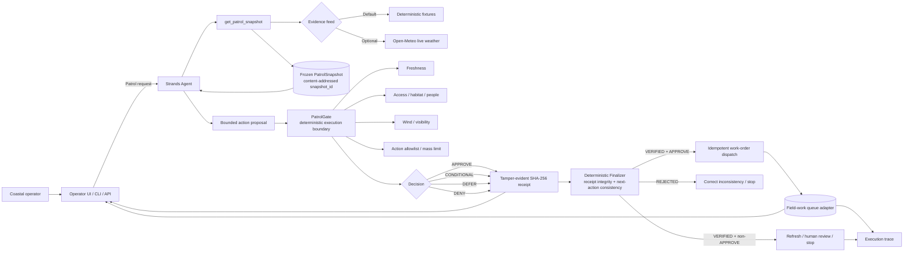
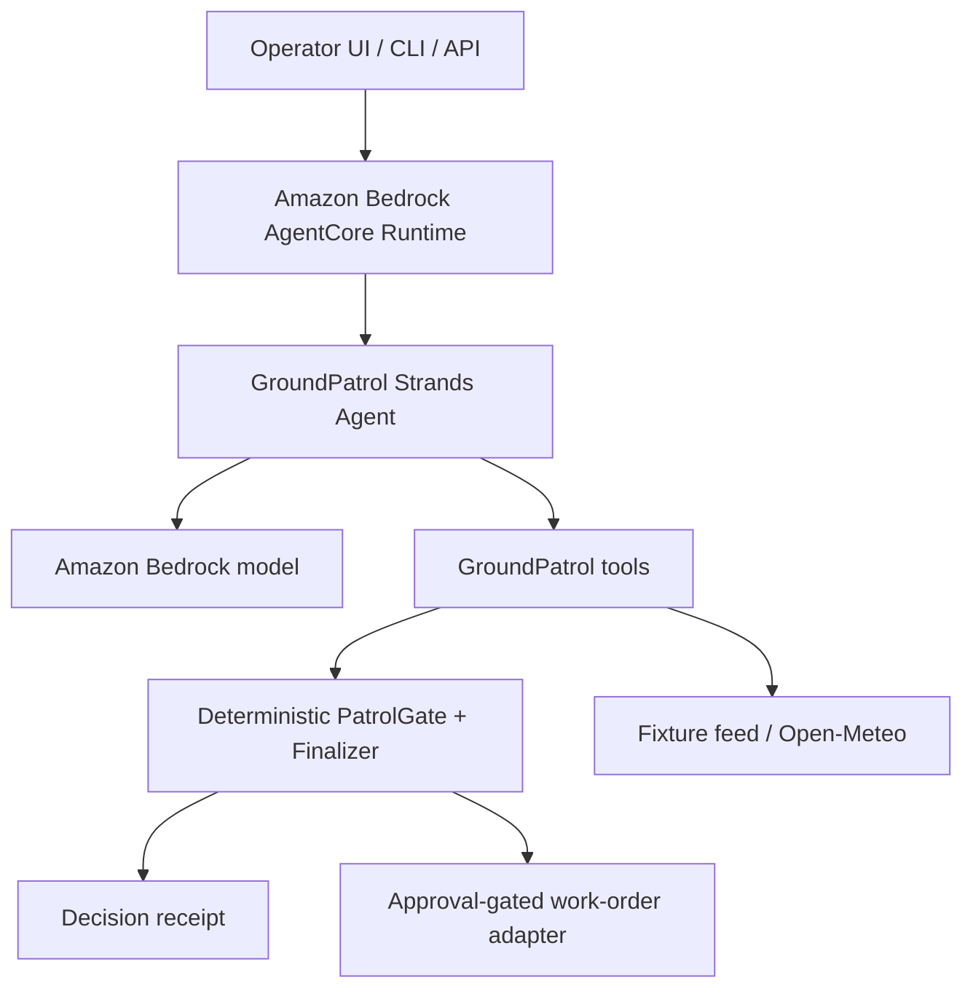

# GroundPatrol architecture diagram

## AWS deployment view

The architecture deliberately separates probabilistic interpretation from deterministic execution authority. The model can propose; the gate decides whether the proposal is cleared; the finalizer checks that the agent's intended next action is consistent with that recorded decision; the side-effect adapter re-checks approval before dispatch.
